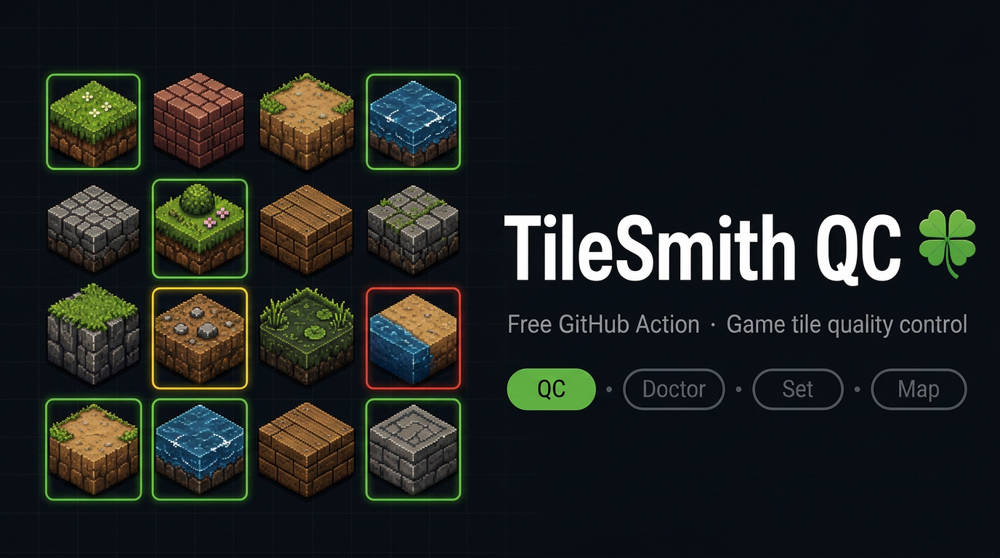
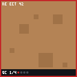

<p align="center">
  
</p>

<h1 align="center">TileSmith QC</h1>

<p align="center">
  <strong>Free, zero-friction tile quality control for game projects — right in your pull requests.</strong><br>
  Brought to you by <a href="https://tilesmith.kleeblatt.space">TileSmith Studio</a> 🍀
</p>

<p align="center">
  <a href="https://github.com/KleeBlattSpace/tilesmith-actions/actions/workflows/selftest.yml"></a>
  <a href="https://github.com/KleeBlattSpace/tilesmith-actions/releases"></a>
  <a href="https://github.com/marketplace/actions/tilesmith-qc"></a>
  <a href="LICENSE"></a>
</p>

---

TileSmith QC scores your game tiles for **seams, borders, and visual artifacts** on every pull request, writes a machine-readable report plus per-tile overlay images, and leaves a tidy summary comment — so broken tiles never quietly reach your main branch.

- **Zero setup for users**: no dependencies, no build step — just add 6 lines of YAML.
- **Zero-retention**: images are scored in workflow memory and never stored.
- **Zero-friction on forks**: pull requests without access to your secrets are handled gracefully and never fail.

## How it works

1. The action finds PNG, JPEG, and WebP tiles below the paths you configure.
2. Each tile is scored through the TileSmith API (free key from the [dashboard](https://tilesmith.kleeblatt.space)).
3. You get: a **PR comment** with a per-tile table, an **overlay PNG per tile** (frame color = verdict), a **step summary**, `report.json`, and workflow **outputs**.

|                                      `Production` ✅                                       |                                    `Review` ⚠️                                     |                                    `Reject` ❌                                     |
| :----------------------------------------------------------------------------------------: | :--------------------------------------------------------------------------------: | :--------------------------------------------------------------------------------: |
|  |  |  |
|                                     Score 97 — ship it                                     |                               Score 78 — check seams                               |                             Score 42 — artifacts found                             |

_Example overlays generated by this action from CC0 tiles (Kenney)._

> 📖 **Documentation** — [Usage guide](docs/usage-guide.md) · [How scoring works](docs/how-scoring-works.md) · [Fair use](docs/fair-use.md)

## Quickstart

1. Sign in at [tilesmith.kleeblatt.space](https://tilesmith.kleeblatt.space) → **Account & API Keys**, create a key (`tsmith_live_…` — shown only once), and store it as the `TILESMITH_API_KEY` secret (**Settings → Secrets and variables → Actions**).
2. Add this workflow as `.github/workflows/tilesmith.yml`:

```yaml
name: TileSmith QC
on: [pull_request]
permissions:
  contents: read
  pull-requests: write
jobs:
  qc:
    runs-on: ubuntu-latest
    steps:
      - uses: actions/checkout@v4
      - uses: KleeBlattSpace/tilesmith-actions@v1
        with:
          api-key: ${{ secrets.TILESMITH_API_KEY }}
          paths: 'assets/**'
      - uses: actions/upload-artifact@v4
        if: always()
        with:
          name: tilesmith-report
          path: tilesmith-report/
```

The artifact contains `report.json` plus one overlay PNG per tile — exactly like the examples above.

> **No API key?** The action prints a notice and exits successfully. Fork PRs without secrets (and repos trying it out) never break their workflows.

## Inputs

| Input           |     Default | Description                                                                                                          |
| --------------- | ----------: | -------------------------------------------------------------------------------------------------------------------- |
| `api-key`       |   _(empty)_ | TileSmith API key (`tsmith_live_…`). Optional: empty key ⇒ skip with notice instead of failing.                      |
| `paths`         | `assets/**` | Comma-separated glob patterns. `**` crosses directories, `*`/`?` stay in one segment; a bare dir acts like `dir/**`. |
| `fail-on`       |    `Reject` | `Reject`, `Review`, or `never`.                                                                                      |
| `max-files`     |       `100` | Maximum 1–500 tiles per run (a notice is emitted when the limit is hit).                                             |
| `upload-report` |      `true` | Upload the aggregate report (see [Privacy](#privacy)). Set to `false` to score fully offline from our side.          |

## Outputs

| Output                             | Description                                          |
| ---------------------------------- | ---------------------------------------------------- |
| `production` / `review` / `reject` | Number of tiles in each gate.                        |
| `skipped`                          | Tiles that could not be scored (network/API errors). |
| `avg`                              | Average score.                                       |
| `report`                           | Path to `tilesmith-report/report.json`.              |

Exit codes: `0` = OK · `1` = quality gate tripped (`fail-on`) · `2` = configuration/auth/quota error.

## Example PR comment

```markdown
## TileSmith QC

| ✅ Production | ⚠️ Review | ❌ Reject | Average  |
| :-----------: | :-------: | :-------: | :------: |
|     **3**     |   **2**   |   **1**   | **91.4** |

**6** tiles scored

Account & API Keys — create, rotate, revoke · usage stats · billing · Marketplace

(per-tile table, collapsed)

🍀 This service is free. …
```

The comment is upserted — one comment per PR, updated in place, never spamming your threads.

## Privacy

> 🍀 This service is free under [fair use](docs/fair-use.md). To keep it free, we collect anonymous scoring logs (scores, gate, size class, timestamp). Images and personal data are never stored.

- Image bytes stay in workflow memory; only scores and metadata are processed. No custom telemetry is emitted by this action.
- With `upload-report: true` (default), an **aggregate** summary is sent to the TileSmith API after each run: repo, ref, commit, action version, gate counts, average score, and per-tile `file` name, score, gate, and size class. Set `upload-report: false` if you do not want that.

## Pricing and fair use

There is **no published monthly call limit** on Free right now — hobby and small-studio CI is the point. That is **fair use**, not a capacity SLA. See the [fair use policy](docs/fair-use.md).

- One **successful** score = one billable unit. Watch live counts under [Account & API Keys](https://tilesmith.kleeblatt.space).
- Rate limits (HTTP 429) and quota (HTTP 402) still apply; 402 exits `2` with a dashboard link.
- A published monthly allowance may be added later. Do not build a product on “unlimited.”

## FAQ and troubleshooting

<details>
<summary><strong>Fork PRs / missing API key</strong></summary>

The action emits a notice and exits `0` — OSS workflows keep working. Add `api-key` as a repository secret; forks of _your_ repo never see it, which is expected behavior.
</details>

<details>
<summary><strong>Authentication (401/403) or quota (402) errors</strong></summary>

Exit code `2` with an actionable message. Check the key in the [dashboard](https://tilesmith.kleeblatt.space); quota errors include an upgrade link.
</details>

<details>
<summary><strong>Network and server failures</strong></summary>

Retried with exponential backoff; rate limits respect `Retry-After`. Tiles that still fail are counted in the `skipped` output and never break the run.
</details>

<details>
<summary><strong><code>paths</code> matches nothing</strong></summary>

A `::warning` is emitted when no tiles are found. Check the patterns: `**` crosses directories, `*` and `?` stay within one path segment (`assets/*` = direct children of `assets/` only).
</details>

<details>
<summary><strong>I want results without failing the build</strong></summary>

Set `fail-on: never` — scores and reports are still produced, the workflow stays green.
</details>

## Support

| Situation                     | Where to go                                                                                             |
| ----------------------------- | ------------------------------------------------------------------------------------------------------- |
| 🐛 Bug in this action         | [Open an issue](https://github.com/KleeBlattSpace/tilesmith-actions/issues/new?template=bug_report.yml) |
| ❓ Questions & usage help     | [GitHub Discussions](https://github.com/KleeBlattSpace/tilesmith-actions/discussions)                   |
| 🔑 API key, quota, or billing | [admin@kleeblatt.space](mailto:admin@kleeblatt.space) · [dashboard](https://tilesmith.kleeblatt.space)  |
| 🔒 Security                   | Follow [SECURITY.md](SECURITY.md)                                                                       |

We aim to respond within a few business days. See [SUPPORT.md](SUPPORT.md) for details.

## Development

```bash
npm ci
npm test             # unit + API-contract tests
node test/smoke.mjs  # end-to-end run of dist/ against a local mock API
npm run build        # rebuild dist/index.mjs (kept committed; CI auto-syncs it)
npm run lint
npm run format:check
```

PRs welcome — see [CONTRIBUTING.md](CONTRIBUTING.md). The committed `dist/index.mjs` is the runtime artifact, so consuming workflows never install dependencies. Current status and plans: [ROADMAP.md](ROADMAP.md).

## Versioning

Use the moving major tag `@v1` for compatible releases, or pin an exact version such as `@v1.1.0` for reproducibility. Releases are signed with GitHub build-provenance attestations — verify with `gh attestation verify`.

## License

MIT — see [LICENSE](LICENSE). Test fixtures are CC0 from [Kenney](https://kenney.nl) (see `tests/fixtures/`). Community behavior is governed by our [Code of Conduct](CODE_OF_CONDUCT.md).

---

<p align="center">
  <sub>Made with 🍀 by <a href="https://github.com/KleeBlattSpace">KleeBlattSpace</a> · <a href="https://tilesmith.kleeblatt.space">TileSmith Studio</a></sub><br>
  <sub>Find TileSmith QC on the <a href="https://github.com/marketplace/actions/tilesmith-qc">GitHub Marketplace</a>.</sub>
</p>
